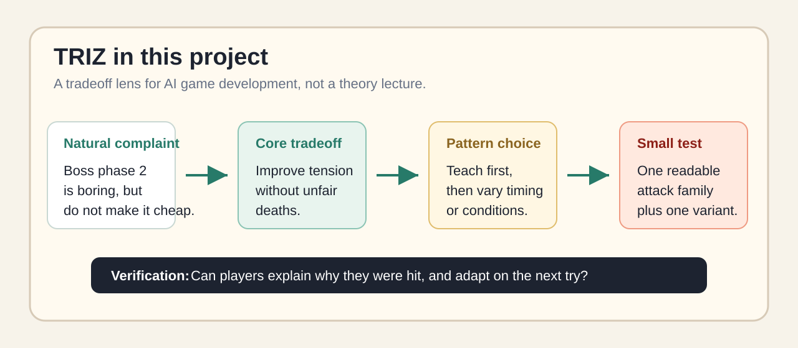
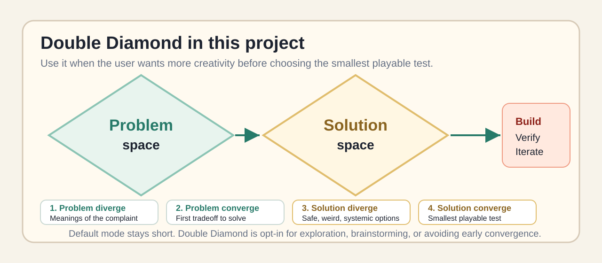

# Stop AI From Overbuilding Your Game

English | [简体中文](README.zh-CN.md)

Natural GameDev Prototype Guardrails for Claude Code and Codex.

No design-theory knowledge required. Turn messy game-dev complaints into small playable tests before an AI agent adds a giant system.

This repository packages a Claude Code skill and Codex project instructions for AI-assisted game development. It helps an AI coding agent move from "combat gets repetitive" or "the HUD is noisy" to a concrete tradeoff, a small prototype slice, and a verification plan before it starts adding features.

Quick links: [playable comparison demo](demo/boss-fight-comparison/index.html) · [install guide](docs/install.md) · [theory under the hood](#theories-under-the-hood)

This is not a game framework. It is a pre-implementation thinking guardrail for AI coding agents.

```text
What should feel better -> What might get worse -> useful pattern -> smallest test -> verification -> iteration
```

The visible workflow stays plain game-dev language; the deeper theory is optional.

Primary use case: **an AI game-dev agent turns a vague design complaint into a bloated feature list**. This project makes it find the tradeoff and the smallest test first.

## The Hook

AI agents love to add features.

This skill makes them ask first:

```text
What should feel better?
What might get worse?
What is the smallest playable test?
How will we know it worked?
```

Use it when your prompt sounds like:

```text
Combat is repetitive.
The HUD is noisy.
Boss phase 2 is boring.
The level feels like a corridor.
AI icons are fast, but the style drifts.
GPT Image 2 keeps adding fake text or extra limbs.
```

## Who Needs This

This project is for people who use AI agents to build games and want better design judgment before more code gets written.

- Solo game developers who prototype fast but do not want every vague idea to become a new system.
- Vibe coders who want AI to slow down just enough to find the real gameplay tradeoff.
- Gameplay designers turning fuzzy feedback like "boring", "too easy", or "confusing" into testable changes.
- Technical artists and asset pipeline builders who need AI speed without style drift, fake text, broken anatomy, or production chaos.
- Small teams using Claude Code or Codex as a junior implementer, design sparring partner, or prototype assistant.
- Toolmakers building reusable workflows for game design, AI-assisted coding, or creative production.

It is especially useful when the request is not a simple bug fix, but a design tension: more depth without more controls, more clarity without more clutter, more content without more inconsistency.

## Before / After

Prompt:

```text
Boss phase 2 is boring, but do not make it cheap.
```

| Generic AI response | Guided response |
|---|---|
| Add more attacks, rage mode, summons, random floor explosions, faster projectiles, more VFX | Teach one readable attack, then add one delayed variant |
| Bigger scope | Smaller playable test |
| Weak proof | Clear check: can players explain why they were hit? |
| Eval: `6/14` | Eval: `14/14` |

Creative mode is still available: double-diamond mode scored `22/22` by exploring more directions first, then converging on a small test.

## Why This Exists

AI agents are fast at adding features, but vague game-dev prompts often produce bloated systems: more buttons, more menus, more content, more hidden complexity.

This workflow pushes the agent to ask a sharper question first:

> What are we trying to improve, and what might get worse if we improve it?

That makes it useful for solo developers, vibe coding, rapid prototypes, combat design, UI/HUD work, level design, narrative tools, asset pipelines, and AI-generated content systems.

## What This Actually Does

- It adds a short design checkpoint before implementation.
- It does not replace your game engine, architecture, design taste, or playtesting.
- It is strongest when a request contains a real tension: depth vs controls, clarity vs clutter, freedom vs pacing, speed vs technical debt.
- It should stay silent for simple edits where no tradeoff exists.

## Will It Increase Token Usage?

Sometimes, yes, in a single model call.

The skill or `AGENTS.md` instructions add a little context, and a guided run may spend extra tokens reframing the problem before coding. If the task is already obvious, that extra brief is not worth it.

The point is not to make every individual call cheaper. The point is to avoid a more expensive cleanup loop.

The better question is:

> Will this small upfront thinking step prevent a larger round of wasted prompts, patches, and rewrites?

It is meant to reduce the cost of:

- building the wrong feature;
- expanding a vague complaint into a bloated system;
- asking the user to correct the same misunderstanding repeatedly;
- writing code that later has to be deleted because it ignored the real tradeoff;
- shipping changes with no acceptance criteria or verification path.

So the useful metric is not just `tokens_per_call`. It is closer to `tokens_to_accepted_result`: how many prompts, patches, corrections, and test runs it takes before the result is actually usable.

For very small edits, skip the workflow because it may only add overhead. For ambiguous design requests, the small upfront token cost can be cheaper than a long cleanup cycle.

## Theories Under The Hood

The default experience stays practical, but the workflow is built from two design ideas: **TRIZ** for resolving tradeoffs, and **Double Diamond** for controlled divergence and convergence.

### TRIZ: Solve The Tradeoff Before Adding Features



In this project, TRIZ is used as a game-dev translation layer:

- Name the contradiction: improve one thing without making another thing worse.
- Prefer the ideal result: get the player benefit without adding a new system, input, UI surface, or production burden.
- Translate principles into practical moves: split, remove, localize, make configurable, add feedback, use templates, or insert adapters.
- End with a small playable test, not a theory-complete design document.

Example: "make the boss more exciting, but not cheap" becomes "increase tension without unfair deaths", then a readable attack variant, then a playtest check.

### Double Diamond: Add Creativity Without Losing Focus



Double Diamond is used when the user asks for brainstorming, more creative range, or "do not converge too early."

- Problem diverge: list possible meanings of the complaint.
- Problem converge: choose the first tradeoff worth solving.
- Solution diverge: explore safe, weird, systemic, content-light, and ambitious options.
- Solution converge: pick the smallest playable test and define what would prove it works.

So the project is not "always be minimal." It is **diverge when creativity is needed, then converge before implementation**.

## Say It Naturally

Users can write normal game-dev complaints:

| Natural prompt | What the workflow infers |
|---|---|
| "Combat gets repetitive after a few minutes." | Improve depth without adding control or balance burden |
| "The HUD is noisy but players still miss important stuff." | Improve clarity without adding clutter |
| "Boss phase 2 is boring, but do not make it cheap." | Add tension without unfair deaths |
| "The level feels like a corridor." | Add freedom without losing pacing |
| "AI icons are fast, but they look like different games." | Increase volume without style drift |
| "GPT Image 2 keeps adding wrong text and weird limbs." | Improve visual richness without losing prompt fidelity |

The user does not need to say formal terms like "contradiction" or "principle".

## GPT Image 2 Mode

The same workflow can guide image-generation prompts.

For GPT Image 2, the common failure is not "the prompt is too short." It is often that the prompt asks for too much at once: title text, complex anatomy, multiple characters, props, UI labels, dramatic action, and final polish in one image.

Use the workflow to define a small content budget first:

```markdown
Image brief:
- Must show: One fantasy warrior poster draft.
- Must avoid: Fake text, extra limbs, extra characters, extra weapons.
- Content budget: One character, one sword, one doorway, one lighting idea.
- Text/anatomy risk: Keep the art textless; add typography later.
- Check: One head, two arms, two legs, plausible hands, no invented words.
```

Then write a narrower prompt. If exact text matters, generate the art without text and add the typography as a separate design or UI layer. If anatomy fails, simplify the pose or edit the broken region instead of making the whole prompt longer.

See [GPT Image 2 controlled generation](claude-code/triz-guided-ai-gamedev/references/gpt-image-2-generation.md) and [poster example](claude-code/triz-guided-ai-gamedev/examples/gpt-image-2-controlled-character-poster.md).

## 30-Second Demo

Prompt:

```text
I want to make combat deeper without making the controls more complex.
Propose the smallest playable test before adding a big system.
```

Expected shape:

```markdown
Prototype brief:
- Improve: Make combat less repetitive and more tactical.
- Watch out: More depth can add input complexity and balance work.
- Useful pattern: Reuse existing inputs, change outcomes by enemy state.
- Smallest test: Keep the same attack button, but add enemy states that change outcomes.
- Check: Build one test encounter and see whether players make more decisions without new controls.
```

Smallest prototype:

- Keep the existing attack input.
- Add three enemy states: `guarding`, `exposed`, and `charging`.
- Make the same attack produce different outcomes: break guard, bonus damage, or interrupt.
- Add clear feedback with placeholder VFX, sound, hit text, or debug labels.
- Keep timing, multipliers, and state durations configurable.

This avoids the common first response of adding skill trees, combo chains, or extra buttons before the core tradeoff is tested.

## Playable Comparison Demo

Open [demo/boss-fight-comparison/index.html](demo/boss-fight-comparison/index.html) to compare two tiny boss-fight prototypes built from the same request:

> The boss phase 2 feels a bit boring. Make it more exciting, but do not make it feel like cheap random one-shots.

- Generic version: adds random attacks to create surprise.
- Guided version: uses one readable attack family, then adds a delayed variant by teaching first and varying later.

The user does not need to say formal terms like "contradiction", "principle", or "learnability". The workflow infers that "more exciting" means surprise/tension, while "cheap random one-shots" points to unfair deaths and weak learning. The demo is intentionally small so the design difference is visible in seconds.

For online hosting, see [docs/github-pages.md](docs/github-pages.md).

## What's Included

```text
SKILL.md
demo/boss-fight-comparison/
claude-code/triz-guided-ai-gamedev/SKILL.md
claude-code/triz-guided-ai-gamedev/references/
claude-code/triz-guided-ai-gamedev/templates/
claude-code/triz-guided-ai-gamedev/examples/
codex/AGENTS.md
docs/
evals/
scripts/
assets/
```

## Install From GitHub

The repository can be pulled directly like a normal GitHub project.

Claude Code personal skill:

```bash
mkdir -p ~/.claude/skills
git clone https://github.com/yfwangning/triz-guided-ai-gamedev-skill.git ~/.claude/skills/triz-guided-ai-gamedev
```

Codex local skill:

```bash
mkdir -p ~/.codex/skills
git clone https://github.com/yfwangning/triz-guided-ai-gamedev-skill.git ~/.codex/skills/triz-guided-ai-gamedev
```

Update later:

```bash
git -C ~/.claude/skills/triz-guided-ai-gamedev pull
git -C ~/.codex/skills/triz-guided-ai-gamedev pull
```

Detailed install notes: [docs/install.md](docs/install.md).

## Script Install For Claude Code

If you already cloned this repository, you can also use the helper script.

Personal install:

```bash
bash scripts/install-claude-skill.sh
```

Project install:

```bash
bash scripts/install-claude-skill.sh --project .
```

Then try:

```text
My RPG combat skills are getting hard to extend. Propose a small data-driven skill prototype before changing the whole combat system.
```

## Project Instructions For Codex

Copy the project instructions into the root of the game repository you want Codex to work on:

```bash
bash scripts/install-codex-agents.sh .
```

Codex will treat `AGENTS.md` as repository instructions for files under that directory tree.

Then try:

```text
I want to make combat deeper without making the controls more complex.
Propose the smallest playable test before adding a big system.
```

## Confirm It Is Working

After installing, send a non-trivial game-dev prompt with a real tradeoff:

```text
The HUD is noisy but players still miss important stuff. Propose the smallest playable test.
```

Expected first shape:

```markdown
Prototype brief:
- Improve:
- Watch out:
- Useful pattern:
- Smallest test:
- Check:
```

If the agent jumps straight into implementation, prompt it once with:

```text
Use passive prototype mode before implementation.
```

## Passive Mode

This package is designed to work as a low-noise passive skill.

After installing it, you should not need to mention any design framework. For non-trivial game-dev requests with a real tradeoff, the agent should briefly insert:

```markdown
Prototype brief:
- Improve:
- Watch out:
- Useful pattern:
- Smallest test:
- Check:
```

Then it should continue with the requested plan or implementation.

It should skip the brief for direct tasks like bug fixes, renames, copy edits, asset swaps, simple numeric tuning, or narrow code explanations.

Use explicit mode prompts when you want more control:

- `Use passive prototype mode.` - keep the brief short and continue working.
- `Use quick design diagnosis.` - diagnose but do not over-plan.
- `Use full design pass.` - produce options and a prototype plan.
- `Use double-diamond mode.` - diverge on possible problems and solutions before choosing a small test.
- `Show the underlying principles explicitly.` - reveal the formal pattern names behind the plain-language brief.
- `Turn this into a coding-agent prompt.` - produce implementation-ready instructions.

## When Not To Use It

Skip the workflow when the task is already direct and low-risk:

- Fix a clearly scoped bug.
- Rename a file, field, variable, asset, or label.
- Change a color, number, copy string, or config value the user already specified.
- Apply an exact implementation plan the user already chose.
- Answer a narrow code question without changing design behavior.

In those cases, the best behavior is to do the task directly and keep the design brief out of the way.

## Example Library

- [Game-dev tradeoff principles and solution patterns](claude-code/triz-guided-ai-gamedev/references/triz-game-patterns.md)
- [Data-driven combat skill system](claude-code/triz-guided-ai-gamedev/examples/combat-skill-system.md)
- [Combat depth without more buttons](claude-code/triz-guided-ai-gamedev/examples/combat-depth-without-more-buttons.md)
- [HUD clarity without clutter](claude-code/triz-guided-ai-gamedev/examples/hud-clarity-without-clutter.md)
- [Level freedom without lost pacing](claude-code/triz-guided-ai-gamedev/examples/level-freedom-without-lost-pacing.md)
- [NPC dialogue variety without lore chaos](claude-code/triz-guided-ai-gamedev/examples/npc-dialogue-variety-without-lore-chaos.md)
- [AI art batches without style drift](claude-code/triz-guided-ai-gamedev/examples/ai-art-batches-without-style-drift.md)
- [GPT Image 2 poster without wrong text or extra limbs](claude-code/triz-guided-ai-gamedev/examples/gpt-image-2-controlled-character-poster.md)
- [Solo dev speed without technical debt](claude-code/triz-guided-ai-gamedev/examples/solo-dev-speed-without-tech-debt.md)

## Output Modes

Use these phrases when you want a specific level of depth:

```text
Use quick design diagnosis for this feature idea.
```

```text
Use full design pass and give me three implementation options.
```

```text
Use double-diamond mode. Do not converge too early; explore possible causes and more creative options first.
```

```text
Turn the recommended option into a Claude Code / Codex task prompt.
```

```text
Use the smallest playable prototype path, then give me acceptance criteria.
```

## Quality Bar

A useful output should include:

- Desired improvement.
- What might get worse.
- Two to four relevant solution patterns.
- Concrete game-dev consequences for each pattern.
- A smallest useful prototype slice.
- A verification method.
- Clear non-goals to prevent scope creep.

See [evals/checklist.md](evals/checklist.md) for a lightweight review checklist and sample evaluation prompts.

Latest smoke test: [manual-smoke-test-2026-05-22.md](evals/results/manual-smoke-test-2026-05-22.md).

Mode comparison: [mode-comparison-boss-2026-05-22.md](evals/results/mode-comparison-boss-2026-05-22.md).

Tiny HUD project comparison: [tiny-hud-project-2026-05-23.md](evals/results/tiny-hud-project-2026-05-23.md).

Tiny HUD code A/B test: [tiny-hud-code-ab-2026-05-23.md](evals/results/tiny-hud-code-ab-2026-05-23.md).

Real small repo HUD A/B test: [real-small-repo-hud-ab-2026-05-23.md](evals/results/real-small-repo-hud-ab-2026-05-23.md).

Live Codex HUD A/B test with complete transcripts and screenshots: [live-codex-hud-ab-2026-05-23.md](evals/results/live-codex-hud-ab-2026-05-23.md).

Run local validation:

```bash
bash scripts/validate.sh
```

Check a generated output:

```bash
node scripts/check-eval-output.mjs evals/sample-outputs/combat-depth-good.md
```

The eval score is a smoke test for structure and scope control. It is not a claim that the design is objectively correct; screenshots, playtests, and human review still matter.

For image generation, the equivalent human review is: exact text if any, no invented text, correct subject count, plausible anatomy, no unwanted props, and style consistency at final display size.

## Workflow Compatibility

- [Superpowers integration](docs/superpowers-integration.md)
- [FAQ](docs/faq.md)
- [Double-diamond mode](claude-code/triz-guided-ai-gamedev/references/double-diamond-gamedev.md)
- [Showcase prompts](docs/showcase.md)
- [Launch copy](docs/launch-copy.md)

## Social Preview

Use [assets/social-preview.png](assets/social-preview.png) as the GitHub repository social preview. The editable source is [assets/social-preview.svg](assets/social-preview.svg).

## What This Is Not

- Not a full game framework.
- Not a replacement for design judgment or playtesting.
- Not a promise that any design framework has the correct answer.
- Not a prompt that should blindly produce large code changes.

The point is to keep AI-assisted game development focused, testable, and reversible.

## Roadmap

- Add more genre-specific examples: platformer, tactics RPG, survival crafting, roguelike, cozy sim.
- Add engine-specific prompts for Unity, Godot, Phaser, Unreal, and plain Web games.
- Add more GPT Image 2 prompt examples for icons, characters, UI mockups, store capsules, and textless poster workflows.
- Add evaluation transcripts comparing generic AI output with passive guided output.
- Add a short visual walkthrough or GIF for the GitHub landing section.
- Add community-submitted tradeoff patterns.

## Contributing

Contributions are welcome, especially:

- New examples with concrete game-dev tradeoffs.
- Better acceptance criteria and playtest checklists.
- Engine-specific implementation briefs.
- Evaluation prompts that expose weak or overly broad outputs.

See [CONTRIBUTING.md](CONTRIBUTING.md) before opening a pull request.

## License

MIT. See [LICENSE](LICENSE).
