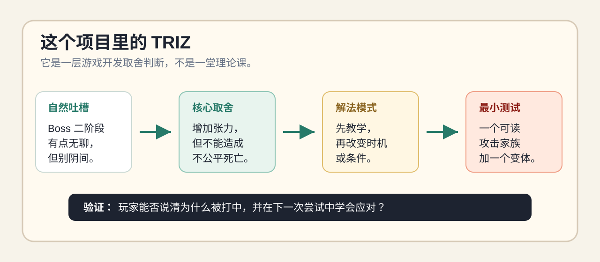
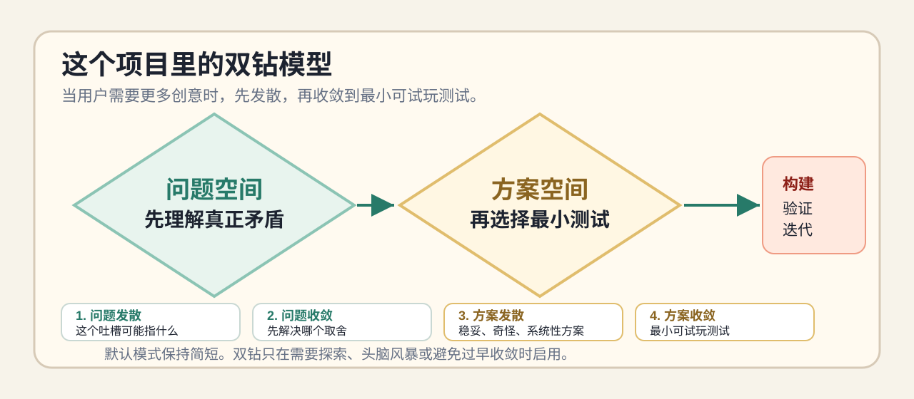

# 别让 AI 把你的游戏越做越大

[English](README.md) | 简体中文

面向 Claude Code 和 Codex 的自然语言游戏原型护栏。

不用懂设计理论。把普通的游戏开发吐槽，转成小而可玩的原型测试，避免 AI 一上来就加大系统。

这个仓库提供一套 Claude Code Skill 和 Codex 项目指令，用于 AI 辅助游戏开发。它会帮助 AI 编程助手在动手加功能之前，先从“战斗有点重复”“HUD 太吵但玩家还是漏信息”“Boss 二阶段有点无聊”这类自然表达里，提炼出隐藏取舍、最小原型切片和验证方式。

快速入口：[可玩对比 Demo](demo/boss-fight-comparison/index.html) · [安装说明](docs/install.md) · [背后的理论](#背后的两个理论)

它不是游戏框架，而是 AI 写代码前的一层设计刹车。

```text
想变好什么 -> 怕变坏什么 -> 可用解法模式 -> 最小试玩 -> 验证 -> 迭代
```

默认给用户看到的是自然的游戏开发语言；背后的理论层是可选的。

最核心使用场景：**AI game-dev agent 把一个模糊设计吐槽扩写成臃肿功能列表**。这个项目会让它先找取舍，再找最小测试。

## 一句话钩子

AI agent 很擅长加功能。

这个 skill 会让它先问：

```text
想变好什么？
可能把什么弄糟？
最小可试玩测试是什么？
怎么知道它真的有效？
```

适合这种自然说法：

```text
战斗有点重复。
HUD 太吵。
Boss 二阶段有点无聊。
关卡像走廊。
AI 图标生成很快，但风格漂了。
```

## 谁需要这个项目

这个项目适合正在用 AI agent 做游戏、但希望 AI 在写更多代码之前先有一点设计判断的人。

- Solo 游戏开发者：原型做得很快，但不希望每个模糊想法都膨胀成一个新系统。
- Vibe coder：希望 AI 别只会加功能，而是先找出真正的玩法取舍。
- 玩法设计者：把“无聊”“太简单”“看不懂”这类模糊反馈，转成可测试的改动。
- 技术美术和素材流水线搭建者：想要 AI 的速度，但不想要风格漂移和生产混乱。
- 小团队：把 Claude Code 或 Codex 当作初级实现者、设计陪练或原型助手。
- 工具作者：想沉淀一套可复用的游戏设计、AI 编程或创意生产工作流。

它尤其适合那些不是简单 bug fix、而是带有设计张力的需求：想更有深度但不增加操作，想更清晰但不增加杂乱，想更多内容但不牺牲一致性。

## Before / After

输入：

```text
Boss 二阶段有点无聊，但别做得太阴间。
```

| 普通 AI 输出 | 引导输出 |
|---|---|
| 加更多攻击、狂暴模式、召唤物、随机地板爆炸、更快弹幕、更多 VFX | 先教一个可读攻击，再加一个延迟变体 |
| 范围变大 | 最小可试玩测试 |
| 缺少验证 | 明确检查：玩家能否说清为什么被打中 |
| Eval: `6/14` | Eval: `14/14` |

需要更多创意时可以用 double-diamond mode：先发散更多方向，再收敛到小测试，样例 eval 为 `22/22`。

## 为什么需要它

AI 很擅长快速加功能，但游戏开发里的模糊需求很容易被扩写成臃肿系统：更多按键、更多菜单、更多内容、更多隐藏复杂度。

这个工作流会先让 AI 问一个更锋利的问题：

> 我们想改善什么？改善它可能会让什么变糟？

它适合 solo 开发、vibe coding、快速原型、战斗设计、UI/HUD、关卡设计、叙事工具、素材流水线和 AI 生成内容系统。

## 它实际做什么

- 在实现之前加一个很短的设计检查点。
- 不替代游戏引擎、项目架构、设计品味或 playtest。
- 最适合有真实张力的需求：深度 vs 操作，清晰 vs 杂乱，自由度 vs 节奏，速度 vs 技术债。
- 遇到没有取舍的简单修改时，它应该保持安静。

## 它会增加 token 消耗吗

单次调用可能会。

Skill 或 `AGENTS.md` 本身会占一点上下文，引导模式也可能先花一些 token 重构问题，再开始写代码。如果任务本来就很明确，这个 brief 可能只是额外开销。

这个项目的目标不是让每一次调用都更便宜，而是避免后面更贵的返工循环。

更值得问的是：

> 前面这点思考成本，能不能避免后面更多无效 prompt、补丁和重写？

它想减少的是这些成本：

- 做错方向以后重做；
- 把一句模糊吐槽扩写成臃肿系统；
- 用户反复纠正“不是这个意思”；
- 写出一堆后来要删除的代码，因为一开始没抓住真正取舍；
- 没有验收标准和验证路径，后面继续来回试错。

所以更值得看的指标不是 `tokens_per_call`，而是 `tokens_to_accepted_result`：从提出需求到得到可接受结果，总共用了多少 prompt、补丁、纠错和测试。

对于很小、很明确的改动，应该跳过这个工作流，因为它可能只会增加开销。对于模糊的设计需求，前面多花一点 token 做 brief，往往比后面长时间清理更便宜。

## 背后的两个理论

默认使用体验仍然是自然语言和实际开发问题，但这个工作流背后主要用了两个设计思想：**TRIZ** 用来处理取舍，**双钻模型** 用来控制发散和收敛。

### TRIZ：先解决取舍，再加功能



在这个项目里，TRIZ 不是让用户背原则，而是被翻译成游戏开发里的判断层：

- 先说清矛盾：想改善一个东西，但不要把另一个东西变糟。
- 追求理想结果：能不能不新增系统、不新增按键、不新增 UI 面板、不增加生产负担，也获得玩家体验收益。
- 把原则翻译成实际动作：拆分、移除、局部处理、参数化、增加反馈、使用模板、插入适配层。
- 最后落到一个最小可试玩测试，而不是一份理论上完整但不可验证的大方案。

例子：“让 Boss 更刺激，但别阴间”会被转成“增加张力，但不能造成不公平死亡”，再落成一个可读攻击变体和一次 playtest 检查。

### 双钻模型：需要创意时先发散再收敛



双钻模型用于用户明确想要头脑风暴、更多创意方向，或者提醒“不要太早收敛”的场景。

- 问题发散：这个吐槽可能有哪几种含义。
- 问题收敛：先选择最值得解决的第一个取舍。
- 方案发散：提出稳妥、奇怪、系统性、低内容成本、野心更大的选项。
- 方案收敛：选出最小可试玩测试，并说明什么结果能证明它有效。

所以这个项目不是“永远只做最小方案”。它更准确地说是：**需要创意时先发散，真正实现前再收敛**。

## 用户可以自然表达

用户不需要学术语，正常说游戏开发里的吐槽就行：

| 自然说法 | 工作流会推导出的取舍 |
|---|---|
| “战斗几分钟后就重复了。” | 想增加深度，但不能增加操作和调平衡负担 |
| “HUD 很吵，但玩家还是漏重要信息。” | 想提高清晰度，但不能让画面更乱 |
| “Boss 二阶段有点无聊，但别做得太阴间。” | 想增加张力，但不能造成不公平死亡 |
| “关卡像走廊。” | 想增加自由度，但不能丢节奏 |
| “AI 图标生成很快，但看起来像不同游戏。” | 想提高产量，但不能风格漂移 |

用户不需要说“矛盾”“原则”这类正式术语。

## 30 秒示例

输入：

```text
我想让战斗更有深度，但不想增加操作复杂度。
先提出最小可试玩测试，不要一上来加大系统。
```

期望输出结构：

```markdown
Prototype brief:
- Improve: 让战斗减少重复感，增加战术决策。
- Watch out: 更多深度可能带来更多按键、教程和调平衡成本。
- Useful pattern: 复用现有输入，让敌人状态改变同一攻击的结果。
- Smallest test: 保留同一个攻击按钮，但加入敌人状态，让同一输入产生不同结果。
- Check: 做一个测试遭遇，验证玩家是否在不增加操作的情况下做出更多决策。
```

最小原型：

- 保留现有攻击输入。
- 增加三种敌人状态：`guarding`、`exposed`、`charging`。
- 同一次攻击根据敌人状态产生不同结果：破防、额外伤害、打断。
- 用占位 VFX、音效、飘字或 debug 标签提供清晰反馈。
- 状态持续时间、伤害倍率和打断窗口都保持可配置。

这样可以避免 AI 一上来就加技能树、连招、新按键或复杂装备系统。

## 可玩对比 Demo

打开 [demo/boss-fight-comparison/index.html](demo/boss-fight-comparison/index.html)，可以对比同一个需求下的两个极小 Boss 原型：

> Boss 二阶段有点无聊，想刺激一点，但别做成那种阴间随机秒人。

- 普通版本：通过随机增加攻击来制造惊喜。
- 引导版本：只使用一个可读的攻击家族，先教基础版，再加入延迟变体。

用户不需要主动说出“矛盾”“原则”或“可学习性”这类正式术语。工作流会从“刺激一点”推导出惊喜/张力，从“别阴间随机秒人”推导出公平死亡和可学习性风险。这个 demo 故意做得很小，方便几秒内看出设计差异。

如果要放到 GitHub Pages，看 [docs/github-pages.md](docs/github-pages.md)。

## 包含内容

```text
SKILL.md
demo/boss-fight-comparison/
claude-code/triz-guided-ai-gamedev/SKILL.md
claude-code/triz-guided-ai-gamedev/references/
claude-code/triz-guided-ai-gamedev/templates/
claude-code/triz-guided-ai-gamedev/examples/
codex/AGENTS.md
docs/
evals/
scripts/
assets/
```

## 从 GitHub 直接安装

这个仓库现在可以像普通 GitHub 项目一样直接拉取。

安装成 Claude Code 个人 skill：

```bash
mkdir -p ~/.claude/skills
git clone https://github.com/yfwangning/triz-guided-ai-gamedev-skill.git ~/.claude/skills/triz-guided-ai-gamedev
```

安装成 Codex 本地 skill：

```bash
mkdir -p ~/.codex/skills
git clone https://github.com/yfwangning/triz-guided-ai-gamedev-skill.git ~/.codex/skills/triz-guided-ai-gamedev
```

以后更新：

```bash
git -C ~/.claude/skills/triz-guided-ai-gamedev pull
git -C ~/.codex/skills/triz-guided-ai-gamedev pull
```

详细安装说明：[docs/install.md](docs/install.md)。

## 脚本安装到 Claude Code

如果你已经 clone 了这个仓库，也可以使用辅助脚本。

个人全局安装：

```bash
bash scripts/install-claude-skill.sh
```

项目内安装：

```bash
bash scripts/install-claude-skill.sh --project .
```

然后可以尝试：

```text
我的 RPG 技能越来越难扩展。先提出一个小的数据驱动技能原型，不要一上来重写整个战斗系统。
```

## 安装成 Codex 项目指令

把项目指令复制到你的游戏项目根目录：

```bash
bash scripts/install-codex-agents.sh .
```

Codex 会把 `AGENTS.md` 当作这个目录树下的项目规则。

然后可以尝试：

```text
我想让战斗更有深度，但不想增加操作复杂度。
先提出最小可试玩测试，不要一上来加大系统。
```

## 如何确认它生效

安装后，发送一个带有真实取舍的非简单游戏开发请求：

```text
HUD 很吵，但玩家还是漏重要信息。先提出最小可试玩测试。
```

预期输出开头应该接近：

```markdown
Prototype brief:
- Improve:
- Watch out:
- Useful pattern:
- Smallest test:
- Check:
```

如果 AI 直接进入实现，可以补一句：

```text
Use passive prototype mode before implementation.
```

## 被动模式

这个包被设计成一个低噪音的被动技能。

安装后，你不需要每次都显式提到任何设计框架。遇到带有真实取舍的非简单游戏开发需求时，AI 应该自动插入一个短 brief：

```markdown
Prototype brief:
- Improve:
- Watch out:
- Useful pattern:
- Smallest test:
- Check:
```

然后继续给出计划或实现。

对于直接任务，它应该跳过 brief，比如修明确 bug、重命名、改文案、替换素材、简单数值调整或解释一段代码。

如果你想手动控制深度，可以这样说：

- `Use passive prototype mode.` - 保持短 brief，然后继续工作。
- `Use quick design diagnosis.` - 快速诊断，不展开太多。
- `Use full design pass.` - 输出完整方案、选项和原型计划。
- `Use double-diamond mode.` - 先发散问题和方案，再收敛到小测试。
- `Show the underlying principles explicitly.` - 显示自然语言 brief 背后的正式模式名。
- `Turn this into a coding-agent prompt.` - 生成可交给编程 agent 的实现任务。

## 什么时候不要用

当任务已经非常直接、风险很低时，应该跳过这个工作流：

- 修一个范围明确的 bug。
- 重命名文件、字段、变量、素材或标签。
- 修改用户已经指定好的颜色、数值、文案或配置。
- 执行用户已经选定的具体实现方案。
- 回答一个窄代码问题，不涉及设计行为变化。

这些情况下，最好的行为是直接完成任务，不要插入设计 brief。

## 示例库

- [游戏开发取舍原则与解决方案模式](claude-code/triz-guided-ai-gamedev/references/triz-game-patterns.md)
- [数据驱动战斗技能系统](claude-code/triz-guided-ai-gamedev/examples/combat-skill-system.md)
- [不增加按键的战斗深度](claude-code/triz-guided-ai-gamedev/examples/combat-depth-without-more-buttons.md)
- [不制造混乱的 HUD 清晰度](claude-code/triz-guided-ai-gamedev/examples/hud-clarity-without-clutter.md)
- [不破坏节奏的关卡自由度](claude-code/triz-guided-ai-gamedev/examples/level-freedom-without-lost-pacing.md)
- [不破坏设定一致性的 NPC 对话变化](claude-code/triz-guided-ai-gamedev/examples/npc-dialogue-variety-without-lore-chaos.md)
- [不产生风格漂移的 AI 美术批量生成](claude-code/triz-guided-ai-gamedev/examples/ai-art-batches-without-style-drift.md)
- [不制造技术债的 solo dev 加速](claude-code/triz-guided-ai-gamedev/examples/solo-dev-speed-without-tech-debt.md)

## 输出模式

当你需要不同深度时，可以使用这些提示：

```text
Use quick design diagnosis for this feature idea.
```

```text
Use full design pass and give me three implementation options.
```

```text
Use double-diamond mode. Do not converge too early; explore possible causes and more creative options first.
```

```text
Turn the recommended option into a Claude Code / Codex task prompt.
```

```text
Use the smallest playable prototype path, then give me acceptance criteria.
```

## 质量标准

一个有用的输出应该包含：

- 想改善的目标。
- 可能被弄糟的地方。
- 两到四个相关解决方案模式。
- 每个模式对应的具体游戏开发动作。
- 一个最小可用原型切片。
- 验证方式。
- 清晰的非目标，避免范围膨胀。

查看 [evals/checklist.md](evals/checklist.md) 获取轻量评估清单和示例评估 prompt。

最新冒烟测试：[manual-smoke-test-2026-05-22.md](evals/results/manual-smoke-test-2026-05-22.md)。

模式对比测试：[mode-comparison-boss-2026-05-22.md](evals/results/mode-comparison-boss-2026-05-22.md)。

HUD 小项目对比：[tiny-hud-project-2026-05-23.md](evals/results/tiny-hud-project-2026-05-23.md)。

HUD 代码 A/B 测试：[tiny-hud-code-ab-2026-05-23.md](evals/results/tiny-hud-code-ab-2026-05-23.md)。

真实小 repo HUD A/B 测试：[real-small-repo-hud-ab-2026-05-23.md](evals/results/real-small-repo-hud-ab-2026-05-23.md)。

带完整对话和截图的 Codex 真实 A/B 测试：[live-codex-hud-ab-2026-05-23.md](evals/results/live-codex-hud-ab-2026-05-23.md)。

本地验证：

```bash
bash scripts/validate.sh
```

检查一次生成输出：

```bash
node scripts/check-eval-output.mjs evals/sample-outputs/combat-depth-good.md
```

Eval 分数只是结构和范围控制的冒烟测试，不代表设计一定客观正确。截图、playtest 和人的设计判断仍然重要。

## 工作流协同

- [Superpowers 协同](docs/superpowers-integration.md)
- [FAQ](docs/faq.md)
- [双钻模式](claude-code/triz-guided-ai-gamedev/references/double-diamond-gamedev.md)
- [Showcase prompts](docs/showcase.md)
- [Launch copy](docs/launch-copy.md)

## 社交预览图

可以用 [assets/social-preview.png](assets/social-preview.png) 作为 GitHub 仓库社交预览图；可编辑源文件是 [assets/social-preview.svg](assets/social-preview.svg)。

## 它不是什么

- 不是完整游戏框架。
- 不是游戏设计判断或 playtest 的替代品。
- 不是说任何设计框架一定能给出正确答案。
- 不是让 AI 盲目生成大规模代码变更的提示词。

它的目标是让 AI 辅助游戏开发更聚焦、更可测试、更容易回退。

## 路线图

- 增加更多类型示例：平台跳跃、战棋 RPG、生存建造、roguelike、cozy sim。
- 增加 Unity、Godot、Phaser、Unreal 和纯 Web 游戏的引擎特定 prompt。
- 增加普通 AI 输出和被动引导输出的对比评估记录。
- 增加 GitHub 首屏用的短图示或 GIF。
- 收集社区提交的游戏开发取舍模式。

## 贡献

欢迎贡献，尤其是：

- 带有具体游戏开发取舍的新示例。
- 更好的验收标准和 playtest 清单。
- 针对特定引擎的实现 brief。
- 能暴露模糊、臃肿、不可执行输出的 eval prompt。

提交 PR 前请先查看 [CONTRIBUTING.md](CONTRIBUTING.md)。

## 许可证

MIT。见 [LICENSE](LICENSE)。
