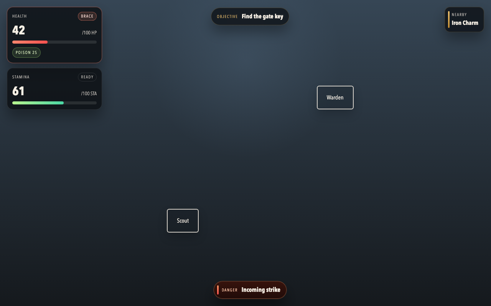
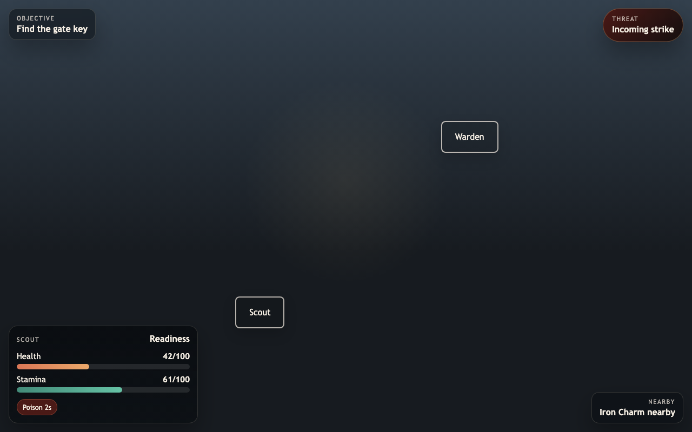

# Live Codex HUD A/B Test

Date: 2026-05-23

This is the stronger version of the earlier tiny HUD A/B test: the same real small repo was run through `codex exec` twice, with complete transcripts and screenshots saved.

Live run folder: [../live-codex-runs/2026-05-23-tiny-roguelite-hud](../live-codex-runs/2026-05-23-tiny-roguelite-hud)

## Shared Request

```text
Players miss important information, but the HUD is already noisy.
Make important information clearer without adding another big UI panel.

Modify this tiny HTML/CSS/JS repo directly. Keep it runnable. Run npm test before finishing.
Do not write a report in the workspace; implement the change.
```

## Evidence

| Evidence | no-workflow | guided |
| --- | --- | --- |
| Complete Codex JSONL transcript | [no-workflow.jsonl](../live-codex-runs/2026-05-23-tiny-roguelite-hud/transcripts/no-workflow.jsonl) | [guided.jsonl](../live-codex-runs/2026-05-23-tiny-roguelite-hud/transcripts/guided.jsonl) |
| Final workspace | [workspaces/no-workflow](../live-codex-runs/2026-05-23-tiny-roguelite-hud/workspaces/no-workflow) | [workspaces/guided](../live-codex-runs/2026-05-23-tiny-roguelite-hud/workspaces/guided) |
| Screenshot | [no-workflow-desktop.png](../live-codex-runs/2026-05-23-tiny-roguelite-hud/screenshots/no-workflow-desktop.png) | [guided-desktop.png](../live-codex-runs/2026-05-23-tiny-roguelite-hud/screenshots/guided-desktop.png) |
| Stderr log | [no-workflow.stderr](../live-codex-runs/2026-05-23-tiny-roguelite-hud/transcripts/no-workflow.stderr) | [guided.stderr](../live-codex-runs/2026-05-23-tiny-roguelite-hud/transcripts/guided.stderr) |

The JSONL transcripts preserve the full Codex turn structure, tool calls, patches, and final messages. Local machine paths and internal service URLs were sanitized before publishing.

## Result Summary

| Dimension | no-workflow | guided |
| --- | --- | --- |
| `codex exec` model | `gpt-5.4` | `gpt-5.4` |
| Project instructions | none | project `AGENTS.md` |
| Transcript length | 59 JSONL lines | 97 JSONL lines |
| HUD/CSS/smoke LOC | 512 | 467 |
| Final test | passed | passed |
| Test depth | export-only smoke test | render assertions for urgent and calm states |
| Visual shape | survival cards, objective strip, pickup ping, danger cue | compact edge chips, conditional threat callout, vitals dock |

## Interpretation

This run does not show a dramatic "workflow good, no-workflow bad" split. The no-workflow run was already strong because Codex automatically loaded its built-in game UI skill for the HUD task.

The meaningful difference is more specific:

- The guided run began by translating the vague user request into an explicit prototype brief: improvement, risk, useful pattern, smallest test, and check.
- It treated the request as a paradox: make important information easier to notice without increasing persistent HUD noise.
- It tightened verification by upgrading `scripts/smoke.mjs` from a simple export check to rendered-state assertions.
- It ended with less total HUD/CSS/test code while preserving a compact visual hierarchy.

So the live result supports this narrower claim:

> The workflow is most valuable when it nudges the agent to frame a tradeoff and verify the chosen intervention, not when it replaces the model's domain skill.

## Screenshots

### no-workflow



### guided



## Caveats

- `gpt-5.5` was the default model but the local Codex CLI reported it needed a newer CLI, so the run used `gpt-5.4`.
- Nested browser verification inside `codex exec` was blocked by local runtime/tooling permissions. Screenshots were captured afterward through a local HTTP server and headless Chrome.
- This is still one repo and one prompt. Treat it as a transparent behavioral example, not a statistically meaningful benchmark.
